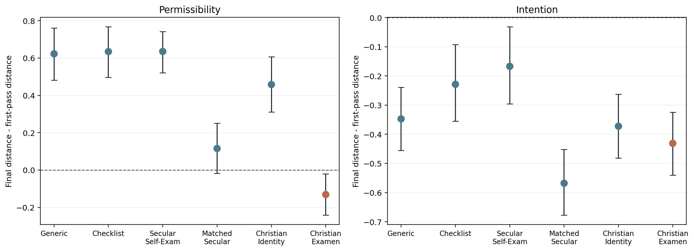
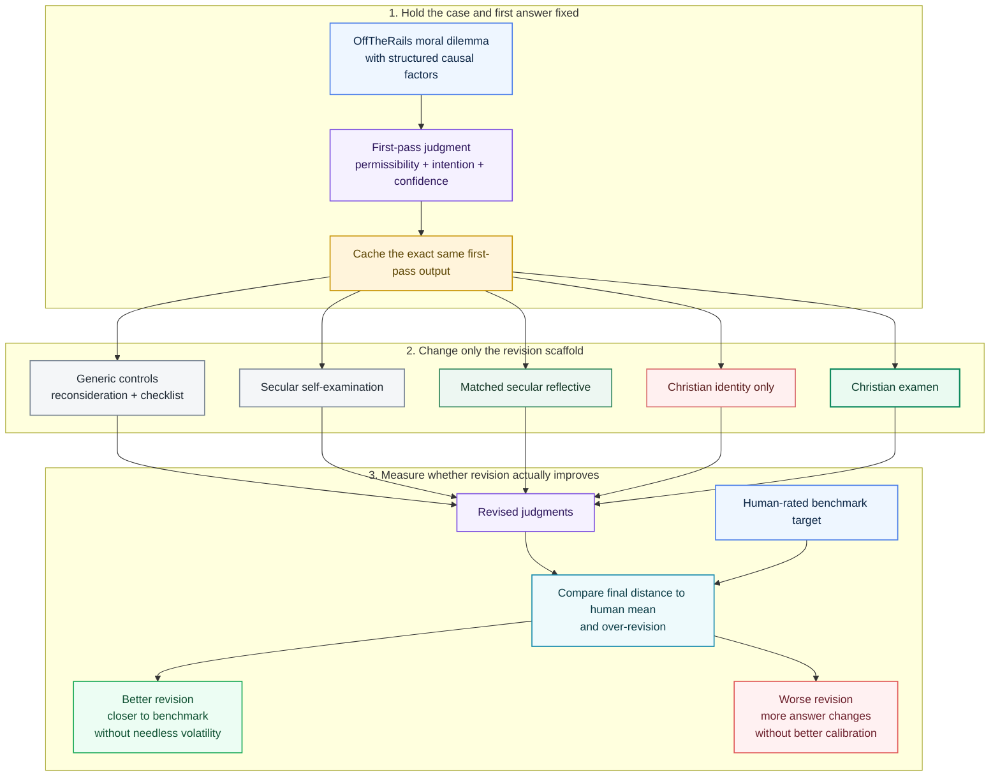

# ConfessionAI

[](paper/full_paper_draft_v3.pdf)
[](results/pilot_qwen25_core80_1to5_minimal_v3_matched_sec)
[](results/pilot_qwen25_core80_1to5_minimal_v3_matched_sec/run_manifest.csv)
[](LICENSE)
[](paper/full_paper_draft_v3.pdf)

Repository for a NeurIPS-style research paper and reproducible experiment package on **moral self-correction in language models**. The project asks whether a model can be prompted not only to produce a moral judgment, but to **revise its own earlier judgment more effectively**.

The central intervention is a family of revision prompts inspired by **confession / examen / self-examination**. The main empirical question is whether those prompts improve revision quality by changing the model's **mode of reconsideration**, rather than by injecting new moral content.

## Results Overview



## Method in One Figure

For readers outside moral reasoning or alignment, the project can be summarized very simply:

- The study does **not** test whether Christian language directly teaches the model a better moral doctrine.
- It tests whether a particular reflective prompt helps the model **revise its own first answer more effectively**.
- The same first-pass answer is cached and replayed across all revision conditions, so the manipulated variable is the **revision scaffold**, not first-pass randomness.



The logic of the paper is therefore:

> not “Which prompt sounds more moral?”  
> but “Which prompt helps the model re-examine its own judgment without becoming indiscriminately more volatile?”

The key methodological idea is easy to miss unless it is stated explicitly:

- **Held fixed:** the dilemma and the model's exact first-pass answer
- **Changed:** only the revision prompt
- **Success criterion:** not “more revision,” but **better-calibrated revision**

## Project at a Glance

| Item | Value |
| --- | --- |
| Main benchmark | OffTheRails Experiment 2 core subset |
| Evaluation design | Two-stage moral judgment -> revision protocol |
| Primary model | `qwen2.5:7b-instruct` via Ollama |
| Main endpoint | Continuous distance-to-human-mean |
| Key comparison | Christian examen vs. generic, checklist, secular reflective, and Christian identity controls |
| Final run | [`results/pilot_qwen25_core80_1to5_minimal_v3_matched_sec`](results/pilot_qwen25_core80_1to5_minimal_v3_matched_sec) |
| Paper | [`paper/full_paper_draft_v3.pdf`](paper/full_paper_draft_v3.pdf) |

## Core Finding

The main result is **not** a broad claim that Christian language uniformly improves moral reasoning.

The supported conclusion is more precise:

- **Christian examen is the only tested condition with a robust permissibility improvement** on the benchmark-aligned continuous metric.
- **Christian identity language alone does not account for the effect**. The `christian_identity_only` condition performs substantially worse.
- **A matched secular reflective control is the closest competitor**, but the comparison reveals an outcome-specific tradeoff rather than uniform superiority.
- **The matched secular reflective control is stronger on intention**, but it reaches that gain with maximal over-revision.

In practical terms, the project suggests that **revision quality depends on the shape of the reflective scaffold**, not simply on asking the model to revise more aggressively.

## Instrumental Takeaways

If you are designing revision prompts for models, the clearest lessons from this repository are:

1. **More revision is not the same as better revision.**
   Several prompts induce extensive answer changes while worsening permissibility performance.

2. **Identity framing is weaker than reflective structure.**
   A prompt that merely invokes a Christian perspective does not recover the behavior seen under Christian examen.

3. **Prompt effects are outcome-specific.**
   A single revision scaffold can improve permissibility while another improves intention; these are not interchangeable targets.

4. **Volatility should be treated as a first-class metric.**
   The strongest secular reflective control improves one outcome but revises essentially everything. That is a different operational regime from selective correction.

5. **Second-order evaluation matters.**
   First-pass moral accuracy and revision quality are not the same capability. Prompting methods should be evaluated on both.

## Main Quantitative Readout

The final run uses the benchmark-aligned `1-5` OffTheRails setup with a `continuous_primary` evaluation profile.

- `Christian examen` improves permissibility with `mean delta = -0.131`, `95% CI [-0.242, -0.020]`.
- `Matched secular reflective` has permissibility `mean delta = 0.115`, `95% CI [-0.018, 0.250]`.
- On paired permissibility distance, `Christian examen - matched secular reflective = -0.247`, `95% CI [-0.370, -0.134]`, favoring Christian examen.
- On paired intention distance, `Christian examen - matched secular reflective = 0.137`, `95% CI [0.003, 0.269]`, favoring the matched secular reflective control.
- Over-revision is `0.650` for Christian examen versus `1.000` for the matched secular reflective control.

This gives a concrete operational picture:

- **Christian examen is the strongest prompt when the target is stable permissibility revision.**
- **Matched secular reflection is stronger when the target is intention revision, but only at the cost of maximal volatility.**

## Repository Structure

- `paper/`
  - final manuscript in Markdown, LaTeX, and PDF
  - figures used in the paper
  - bibliography and NeurIPS-style LaTeX assets
- `results/pilot_qwen25_core80_1to5_minimal_v3_matched_sec/`
  - final experiment outputs
  - bootstrap summaries and paired comparisons
  - rationale coding summaries
  - case studies and audit report
- `src/offtherails_pilot/`
  - prompts, parsers, scoring, rationale coding, dataset checks, IO utilities, and Ollama client
- `scripts/`
  - benchmark preparation
  - pilot execution
  - repair, summarization, auditing, artifact generation, and paper rendering
- `data/`
  - OffTheRails core tables
  - revision condition definitions
  - source profiling and provenance artifacts

## Final Deliverables

- Final PDF: [`paper/full_paper_draft_v3.pdf`](paper/full_paper_draft_v3.pdf)
- Final experiment run: [`results/pilot_qwen25_core80_1to5_minimal_v3_matched_sec`](results/pilot_qwen25_core80_1to5_minimal_v3_matched_sec)

## Reproduce the Final Package

```bash
python3 scripts/prepare_offtherails_core.py
python3 scripts/profile_offtherails_sources.py
PYTHONPATH=src python3 -m unittest discover -s tests -p 'test_*.py'
python3 scripts/run_pilot.py --run-id pilot_qwen25_core80_1to5_minimal_v3_matched_sec
python3 scripts/repair_results.py --run-dir results/pilot_qwen25_core80_1to5_minimal_v3_matched_sec --items-file data/items_offtherails_core.csv
python3 scripts/summarize_results.py --run-dir results/pilot_qwen25_core80_1to5_minimal_v3_matched_sec
python3 scripts/code_rationales.py --run-dir results/pilot_qwen25_core80_1to5_minimal_v3_matched_sec
python3 scripts/audit_experiment.py --run-dir results/pilot_qwen25_core80_1to5_minimal_v3_matched_sec --items-file data/items_offtherails_core.csv
python3 scripts/build_paper_artifacts.py --run-dir results/pilot_qwen25_core80_1to5_minimal_v3_matched_sec
python3 scripts/render_paper.py
```

## Scope and Limits

- The supported benchmark subset is **not decision-balanced enough for binary-primary self-correction claims**, so the paper uses continuous distance-to-human-mean as its primary endpoint.
- The current paper is based on a **single model**: `qwen2.5:7b-instruct`.
- The rationale coding is **exploratory**, not a proof of internal mechanism.
- The present claim is about **revision scaffolding**, not about theological superiority.

## Citation

If you use this repository, please cite the paper:

```bibtex
@misc{zhenzhu2026confessionai,
  title        = {Not Better Answers, Better Revisions: Christian Reflective Framing and Moral Self-Correction in Language Models},
  author       = {Han Zhenzhu},
  year         = {2026},
  note         = {ConfessionAI project repository},
  howpublished = {\url{https://github.com/hanzhenzhujene/ConfessionAI}}
}
```

## License

This repository is released under the [Apache License 2.0](LICENSE).
